<!-- _class: cover_e -->
<!-- _header:  -->
<!-- _footer:  -->
<!-- _paginate: "" -->
# SI100B EE Part
###### Tutorial 1

@Chaofan Li, `lichf1@shanghaitech.edu.cn`
@Yunxiang He, `heyx1@shanghaitech.edu.cn`
@Qihan Ding, `dingqh@shanghaitech.edu.cn`

---
## Contents
<!-- _class: toc_a -->
<!-- _header: "Contents" -->
<!-- _footer: "" -->
<!-- _paginate: "" -->

- [Before Start](#3)
- [1. Windows Enviroment Setup](#5)
- [2. MacOS Envoriment Setup]()
- [3. About Logisim]()


---
## Before Start
<!-- _class: trans -->
<!-- _footer: "" -->
<!-- _paginate: "" -->


---
## Before Start
在开始之前，您可能需要了解以下内容：

- 我们需要使用 Java 运行时环境来完成作业，但请不要担心，我们的作业中不会涉及任何和 Java 有关的内容，它仅仅作为一个运行工具而存在。
- Logisim是一个带有GUI界面的程序，请在您的本地环境中运行它。Java版本应大于16。
- 请使用我们提供的“.jar”文件（版本为“3.8.0”）以避免兼容性问题。Windows、Ubuntu和macOS系统都可以运行它。
- Logicsim不会在进行过程中保存您的工作。记得在开始时保存，并在工作时经常保存。`Command/Control + S` 快捷键允许快速保存。

---
## 1. Windows Enviroment Setup
<!-- _class: trans -->
<!-- _footer: "" -->
<!-- _paginate: "" -->

---
## 1.1. Java 运行时环境配置

点击按钮下载 [Java-17](https://download.oracle.com/java/17/latest/jdk-17_windows-x64_bin.exe)

完成下载之后，双击下载好的 `jdk-17_windows-x64_bin.exe` 文件，进入安装界面

---
## 1.1. Java 运行时环境配置
点击“下一步”：

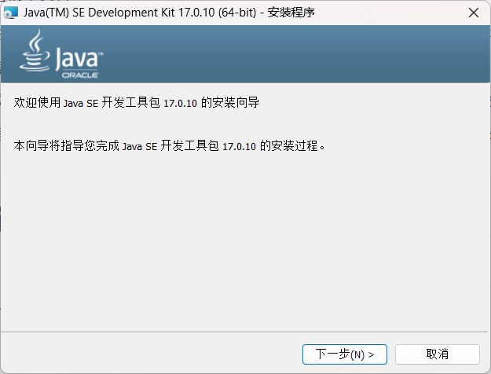

---
## 1.1. Java 运行时环境配置
<!-- _class:  bq-red -->

> 如果你不熟悉，请不要改默认路径！Java 不会占用电脑太多的存储资源，但是默认路径方便后续使用

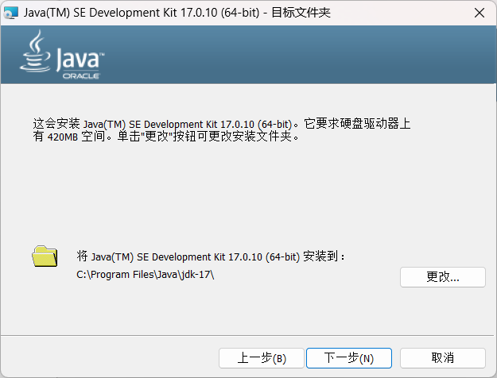


---
## 1.1. Java 运行时环境配置
显示进度条表面进入安装流程：

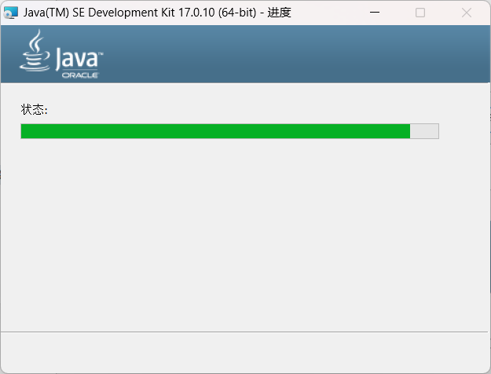

---
## 1.1. Java 运行时环境配置
点击“完成”，完成 Java 环境的安装：

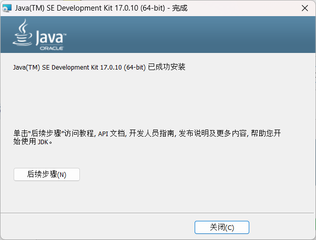

---
## 1.2. 启动logisim
双击打开作业文件夹中的 `logisim-evolution`，即可打开 Logisim 界面！


等待动画加载完成后，发现如下界面，则说明 logicsim 已经成功配置完毕！

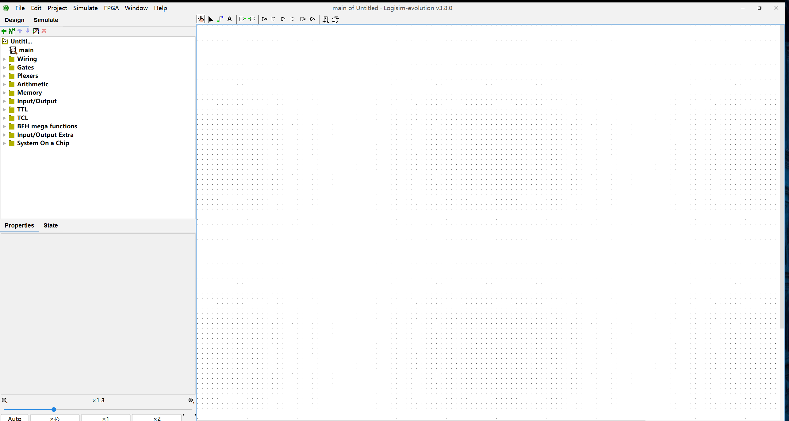


---
## 2. MacOS Enviroment Setup
<!-- _class: trans -->
<!-- _footer: "" -->
<!-- _paginate: "" -->


---
## 2.1. Java 运行时环境配置
#### 使用 `brew` 安装 Java

在 MacOS 中，brew 是帮助我们在命令行快速安装其他应用的工具，因此首先安装 brew。打开mac的终端，输入安装 brew 的命令：

```bash
/bin/bash -c "$(curl -fsSL https://raw.githubusercontent.com/Homebrew/install/HEAD/install.sh)"
```

等待界面加载完成后，我们使用 `brew --version` 。如果出现相关版本信息，则说明 `brew` 被正确安装。

安装好 brew 后，我们使用 brew 安装 java：

```bash
brew install java
```
---
## 2.1. Java 运行时环境配置

<!-- _class: cols-2 -->
<div class=ldiv>  

#### 使用 `brew` 安装 Java
如果出现类似的结果，说明安装正在进行：

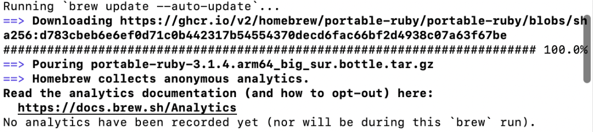

我们耐心等待安装完成即可。

如果安装过程顺利，结果应当如右图所示：
</div>

<div class=rdiv>


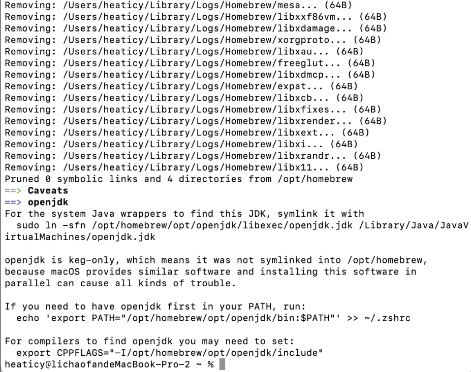
</div>

---

## 2.1. Java 运行时环境配置
#### 添加环境变量

输入 `java --version`。

对于大部分同学而言，输出可能会类似：

```bash
{Your_Username}@{Your_ComputerName} ~ % java --version
The operation couldn’t be completed. Unable to locate a Java Runtime.
Please visit http://www.java.com for information on installing Java.

{Your_Username}@{Your_ComputerName} ~ % java
The operation couldn’t be completed. Unable to locate a Java Runtime.
Please visit http://www.java.com for information on installing Java.

```

说明我们没有添加环境变量。

---

## 2.1. Java 运行时环境配置
#### 添加环境变量
<!-- _class:  bq-red -->


接下来，我们需要把 java 添加到我们的环境变量中，以便我们在命令行中调用：

```bash
sudo ln -sfn /opt/homebrew/opt/openjdk/libexec/openjdk.jdk /Library/Java/JavaVirtualMachines/openjdk.jdk
```

> 注意：关于 'sudo' 之后输入密码相关事宜
> 
> 我们这里调用了 `sudo` （表示使用管理员权限），因此我们需要输入密码。在终端中输入密码，当然，注意此时你输入任何东西都不会显示密码（为了隐私保护）。放心输入正确的密码即可。


---

## 2.1. Java 运行时环境配置
#### 添加环境变量
完成环境变量的配置之后，我们输入 `java --version` 应当会出现 java 的版本信息：

```
{Your_Username}@{Your_ComputerName} ~ % java --version
openjdk 21.0.2 2024-01-16
OpenJDK Runtime Environment Homebrew (build 21.0.2)
OpenJDK 64-Bit Server VM Homebrew (build 21.0.2, mixed mode, sharing)
```


至此，java 运行时环境配置完毕

---

## 2.2. 启动logisim

<!-- _class: cols-2 -->
<div class=ldiv>  

在 MacOS 中启动 Logisim 可能会出现如下问题：报错“无法打开 logisim-evolutoin.jar"：


这是因为我们需要给 Java 提供权限。

</div>

<div class=rdiv>

我们可以打开设置，搜索“安全”，找到“隐私和安全性”：

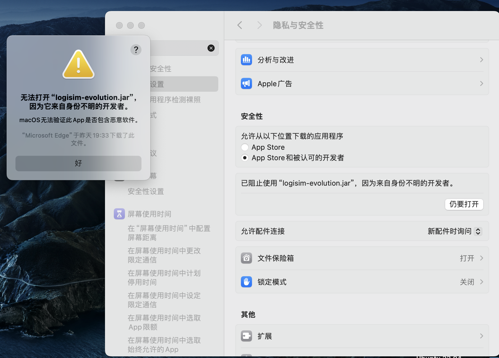
</div>

---

## 2.2. 启动logisim
<!-- _class: cols-2 -->
<div class=ldiv>  

- 此处，我们需要**固执地点击“仍要打开”**：


</div>

<div class=rdiv>

- 等待动画加载完成后，出现下面界面，则说明 logicsim 已经成功配置完毕！

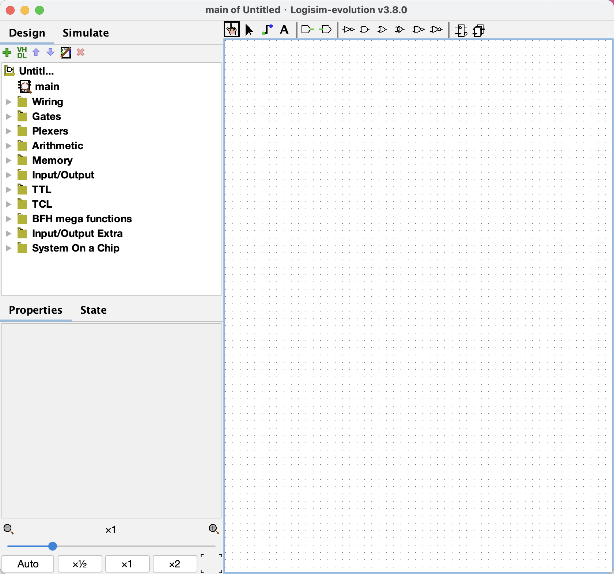

</div>


---
## 3. Get Started With Logisim
<!-- _class: trans -->
<!-- _footer: "" -->
<!-- _paginate: "" -->


---
## 3.1. Task 1: 创建AND门电路
我们将尝试创建一个 `AND` 门电路，以帮助我们学习如何使用 Logisim 。请注意程序左下角的缩放和网格功能，这将在我们构建大型电路设计中的时候更好的进行布线。

 


---
## 3.1. Task 1: 创建AND门电路

1.  首先单击 `AND` 门按钮。这将使 `AND` 门的影像跟随光标移动。在主原窗口中单击一下，就可以放置一个 `AND` 门。

2.  单击 `Input Pin` 按钮。现在，在 `AND` 门左侧的某个位置放置两个输入引脚。

3.  单击 `Output Pin` 按钮。然后在 `AND` 门的右侧放置一个输出引脚。

**此时，您的 Schematic 应该是这样的：**  

---
## 3.1. Task 1: 创建AND门电路
4.  单击 `Select` 工具按钮。单击并拖动，将输入引脚连接到 `AND` 门的左侧。这需要几个步骤，因为**您只能绘制垂直和水平导线**。只需水平绘制导线，松开鼠标键，然后从导线末端开始单击并拖动，继续垂直绘制。您可以将导线连接到左侧 `AND` 门上的任意引脚。重复同样的步骤，将 `AND` 门（右侧）的输出连接到输出引脚。双击这三个引脚，为其命名标签。

   **完成这些步骤后，您的 Schematic 应大致如下：**

   

---
## 3.1. Task 1: 创建AND门电路
5.  单击 `Poke` 工具并尝试单击 Schematic 中的输入引脚。观察会发生什么。
   
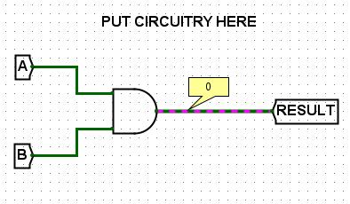

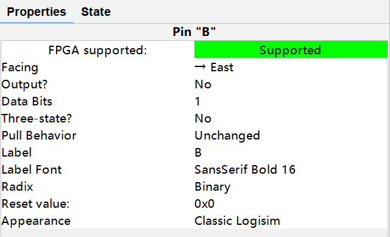

---
## 3.1. Task 1: 创建AND门电路
6. 将电路保存为 `ex0.circ` 。单击 `Simulate -> Test Vector...` 并从 `hw1_release` 文件夹中选择 `testvector_ex0.txt` 文件加载矢量。如果一切顺利，你应该看到所有四个测试向量都通过了。这里展示的是错误连接时的测试结果。

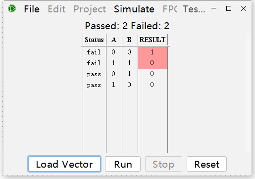
**注意：我们不会对这部分进行评分。**

---
## 3.2. Exercise 1: Pin
针脚是电路的输出还是输入，取决于它的输出值属性（即 Selection 中的 “Output?” ）。

圆形或圆角矩形表示输出针脚，正方形或矩形表示输入针脚。

输入或输出值都会在组件上显示(打印视图除外)。

---
## 3.2. Exercise 2: Tunnel
标签通道的作用类似于导线，但与导线不同的是，连接不是明确绘制的。当你需要连接电路中相隔很远的点时，用标签通道来替代就很有用。下面的插图说明了它是如何工作的：这三个隧道都有相同的标签 a，这三个隧道相当于连接的点。(如果其中一条隧道被标记为其他东西，比如b，那么它将是另一组隧道的一部分)

其主要参数是 “Label（标签）” ，这是一个特别重要的属性，如果两个标签通道的标签名称一样，那么它们相当于之间有导线连接，是连通的。

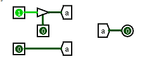

---
## 3.2. Exercise 3: Constant
Constant 输出在 Value（值）属性中指定的值。它只有一个引脚，输出对应位宽属性的值。

其属性包括：
- Data Bits（数据位宽）：指定输出数据的位宽，一个 $n$ 位的常量有 $2^n$ 个可能的值（范围为 $[0,2^{n-1}]$）
- Value（值）：指定常量的值，注意 `0x` 表示的是十六进制

---
## 3.2. Exercise 4: Splitter
<!-- _class: cols-2 -->
<div class=ldiv>  

分线器可以把一个多位的输入拆分为若干位，也可反过来把若干个若干位的输入合并为一个输出，可设置具体拆分方式。
其参数包括：
- Facing（朝向）：控制元件的朝向
- Fan Out（分流端口数）：设置输出端口的数量
- Bit Width In（输入位宽）：设置输入位宽
- Bit X （第X位）：设置第X位数据在哪个口输出
</div>

<div class=rimg>

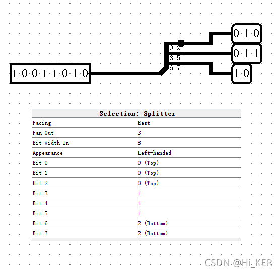

</div>

---
## 3.2. Exercise 5: 构建子电路
<!-- _class: bq-red -->
正如 Python 程序可以包含函数一样， Schematic 也可以包含子电路。在这部分实验中，我们将创建几一些子电路来演示它们的用途。

> 重要提示
> 
> Logisim Evolution 规定，不能用关键字（如 `NAND` ）命名子电路，也不能在名称的第一个字符使用数字。

---
## 3.2. Exercise 5: 构建子电路

#### 请按照以下步骤操作

1. 打开练习 1 的 Schematic  ( `File -> Open -> ex1.circ` )。

2. 双击左侧菜单电路选择器中的 `NAND1` 打开 `NAND1` 空子电路。（注意末尾的 `1` ；因为有一个名为 `NAND` 的组件，所以我们不能将其称为 `NAND` ）。

---
## 3.2. Exercise 5: 构建子电路
3. 在新的 Schematic 窗口中，创建一个简单的 `NAND` 电路，左侧为 2 个输入引脚，右侧为输出引脚。**请不要使用 Gates 文件夹中的内置 `NAND` 门**（即只使用选择工具图标旁边提供的 `AND` 、 `OR` 和 `NOT` 门）。您可以使用选择工具选择输入/输出，并更改窗口左下角的属性 `Label` 来更改输入和输出的标签。

4. 重复上述步骤，再创建几个子电路：
   - `NOR`
   - `XOR`
   - `2-to-1 MUX`
   - `4-to-1 MUX` 

---
## 3.2. Exercise 5: 构建子电路
以4-1选择器为例：总计六位输入，分别是**四路数据输入A、B、C、D**和**两位地址选择sel1、sel2**。我们可以朴素地感知，这个电路通过地址选择将一路输入接通至输出。

**由此可知运行逻辑：**
两位地址选择，采用二进制编码，将被译码为**四位输出（0001或0010或0100或1000）**。通过这四位输出分别和数据输入取逻辑与（AND）并输出，仅有一位数据输入被带出，另外三位输出必为0。最终将取逻辑与之后的四位输出通过四输入或门输出即可。

可推知输出 `Y=Asel1'sel2'+Bsel1'sel2+Csel1sel2'+Dsel1sel2`

---
## 3.2. Exercise 5: 构建子电路
1. 注意事项
   - 请不要更改子电路的名称或创建新的子电路
   - 请在**分别命名**的电路中工作，否则自动跟踪器将无法正常工作。
   - 请勿使用除 `AND` 、 `OR` 和 `NOT` 以外的任何内置门电路。
   - 建立子电路后，您可以（而且我们鼓励您）用它来建立其他电路。您可以像放置其他元件一样，点击并放置您创建的子电路。

---
## 3.2. Exercise 5: 构建子电路
<!-- _class: cols-2 -->
<div class=ldiv>

在作业中，我们有一些标注了 Don't Touch 的电路，这部分是固定位置的输入输出，用于进行作业的结果检测。
- 你可以**复制**它们，但请不要以任何形式**移动**它们。
- 如果因为移动 IO 部分导致测试不通过，TA 有权利不进行补测事宜。
  - 当然，如果你及时发现了问题，可以选择重新下载模板文件。

</div>
<div class=rdiv>

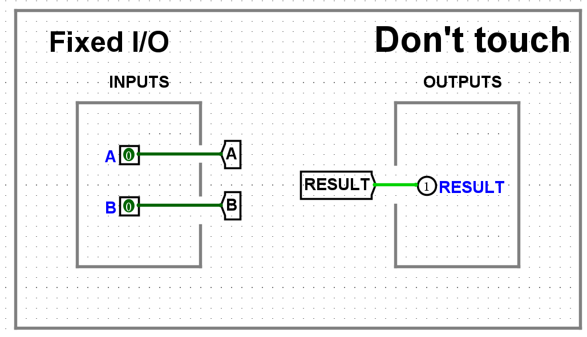

</div>

---
## Appendix
<!-- _class: cols-2 -->

<div class=ldiv>

**异或 XOR; 同或 XNOR; 与非 NAND; 或非 NOR; 传输门 TG.**


使用LaTeX能够轻松打出异或符号和同或符号：[在线 LaTeX 公式编辑器](https://www.latexlive.com/ "真不是overleaf")

- XOR $\to$ `\oplus` $\to \oplus$
- XNOR $\to$`\odot`$\to \odot$

</div>
<div class=rdiv>

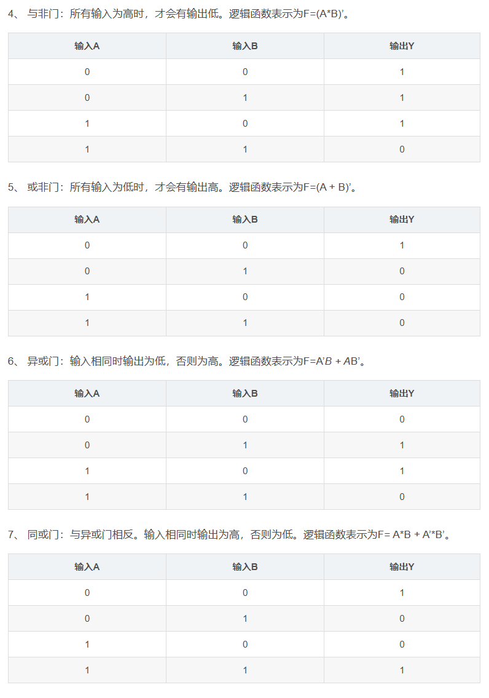


</div>